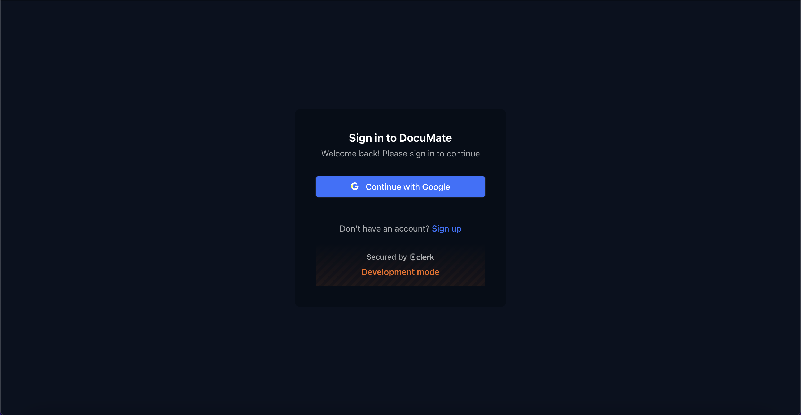
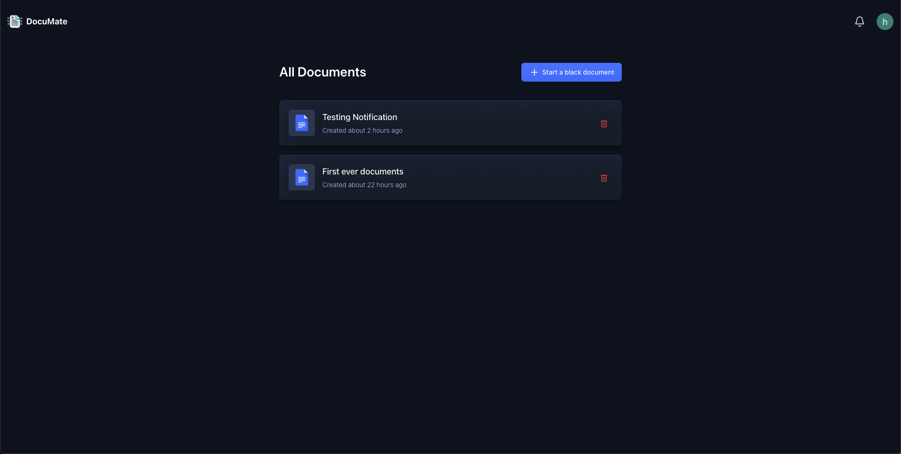
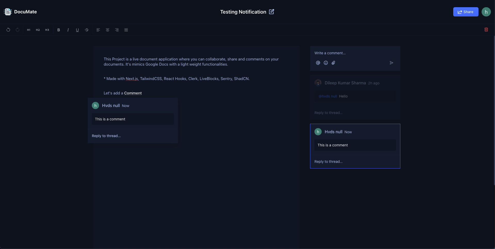
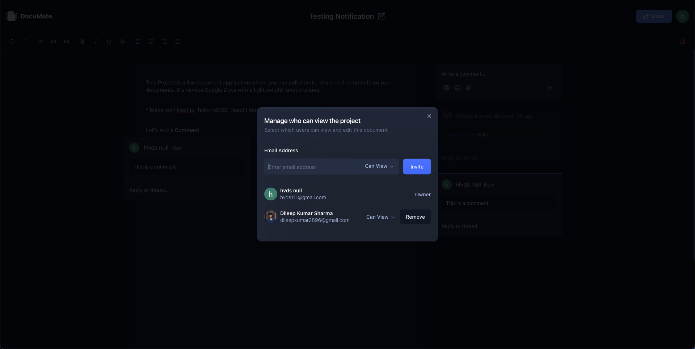

# DocuMate

## Overview

DocuMate is a real-time collaborative document editing and management platform built using modern web technologies. The project enables users to authenticate, create, manage, and share documents with multiple users, providing features like live collaboration, comments, and access control.

## Tech Stack

- **Next.js**: The framework for building the frontend with server-side rendering and API routes.
- **TypeScript**: For static typing and improved code quality across the application.
- **Liveblocks**: Real-time presence and collaboration engine to allow multiple users to work on the same document.
- **Lexical Editor**: A rich-text editor that powers the collaborative editing experience, with plugins for comments and more.
- **ShadCN**: A customizable design system for React.
- **Tailwind CSS**: A utility-first CSS framework for building responsive and modern UIs.

## Features

### Authentication

- **GitHub Authentication**: Secure sign-in and sign-out using GitHub credentials through **NextAuth**.
- **Session Management**: Handles user sessions to enable persistent logins and secure access.

### Collaborative Text Editor

- **Real-time Collaboration**: Users can edit the same document simultaneously with live updates and conflict resolution using **Liveblocks**.
- **Lexical Editor**: Provides a rich-text editing experience with formatting, inline comments, and user-friendly UI.
- **Presence Indicators**: Displays active collaborators in real-time within the document, enabling smooth collaboration.

### Document Management

- **Create Documents**: Users can create new documents which are automatically saved and listed in their document dashboard.
- **Delete Documents**: Users can delete documents they own from their dashboard.
- **Share Documents**: Share documents via email or link with view/edit permissions for granular access control.
- **List Documents**: Lists all documents owned or shared with the user, with features for sorting and searching.

### Comments

- **Inline Comments**: Users can add comments to specific text within a document for collaborative discussions.
- **General Comments**: General comments can be added at the document level, providing a space for feedback.
- **Threaded Discussions**: Comments can be threaded for deeper discussions and easy-to-follow conversation flow.

### Notifications

- **Document Sharing**: Users receive notifications when a document is shared with them.
- **Comments & Collaborator Activities**: Notifications are sent for new comments and activities by collaborators.

### Responsive Design

- **Mobile-Friendly**: The application is fully responsive, providing a seamless experience across desktop, tablet, and mobile devices.

## Code Architecture & Reusability

The project adheres to modular code architecture principles with reusable components and hooks, ensuring maintainability and scalability of the codebase.

## Live Project

Visit the live version of DocuMate [here](https://documate-swart.vercel.app).

## Application Images

| Login Page                        | Home Page                       |
| --------------------------------- | ------------------------------- |
|  |  |

| Document Page                           | Share Document Page                         |
| --------------------------------------- | ------------------------------------------- |
|  |  |

> _Note: Replace `path/to/` with the actual paths to the images._
